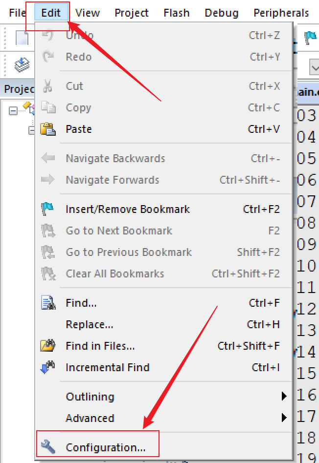
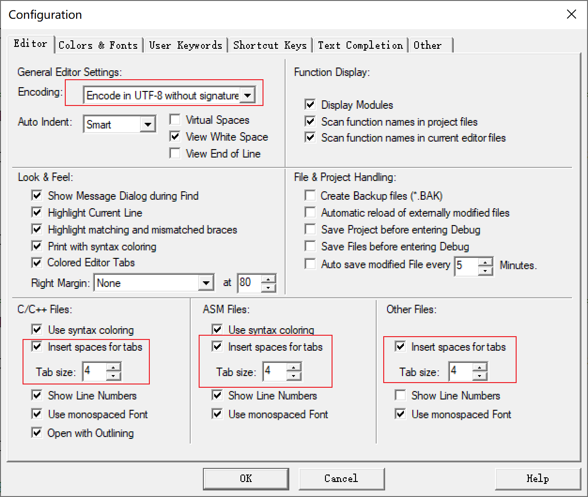
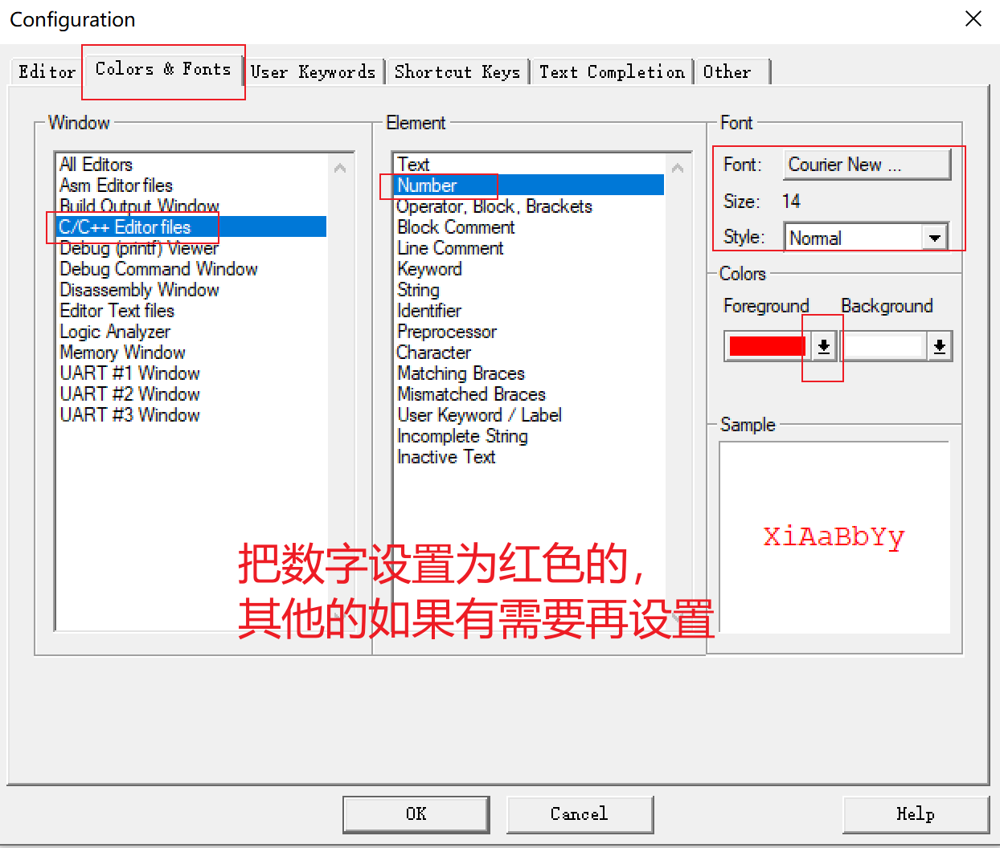
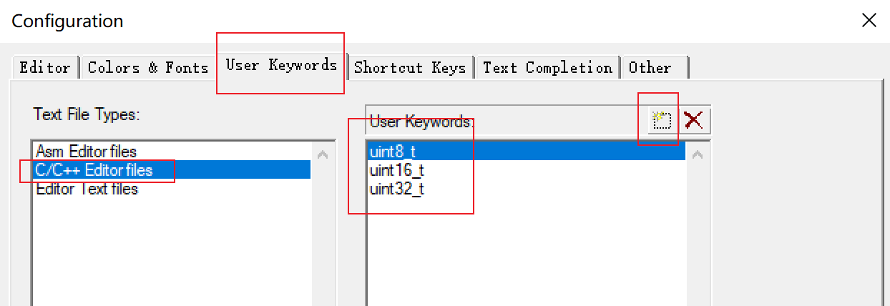
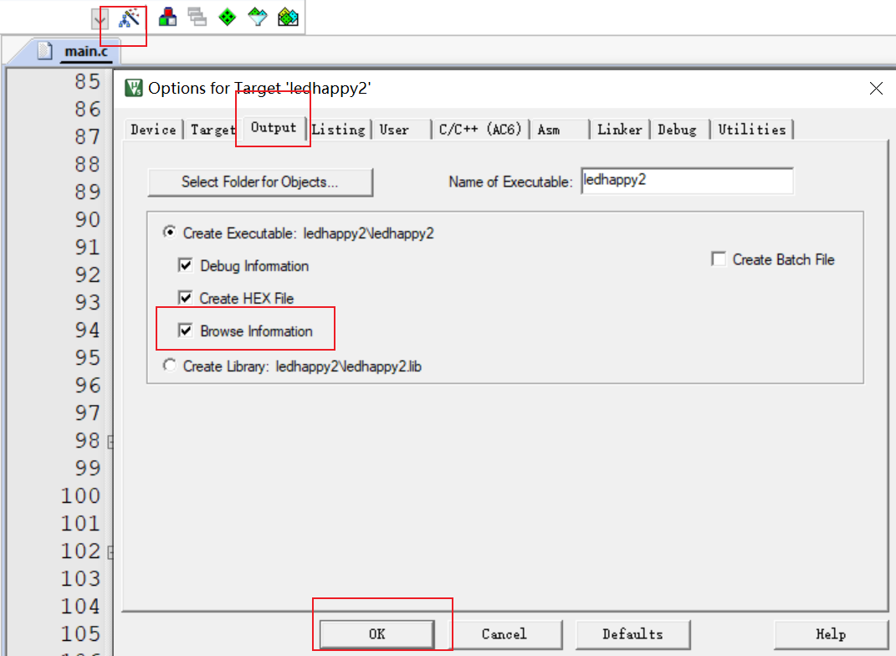

# 常用开发工具简介

|工具|名称|所属公司|说明|
|-|-|-|-|
|IDE|MDK|Keil|STM32最常用的集成开发环境，简单易用|
|IDE|EWARM|IAR|支持STM32开发，用的人少一些|
|仿真器|DAP|ARM|开源、免驱、带虚拟串口功能、速度快、廉价|
|仿真器|STLINK|ST|支持全面、稳定、廉价|
|仿真器|JLINK|Segger|稳定、高速、价格贵|
|串口调试助手|SSCOM|丁丁|稳定、小巧、简单易用|

# Keil uVision 5 (MDK-ARM)

## 下载安装

获取MDK

- MDK软件下载：https://www.keil.com/download/product/
- 器件支持包下载：https://www.keil.com/dd2/pack/ 
    类似Keil.STM32F1xx_DRP.2.4.1.pack，下载后双击安装即可

注意：

- 安装目录及路径不要有任何中文汉字，且路径越短越好
- 电脑系统名和用户名最好不要有任何中文

## 使用技巧

编辑器设置

字体和颜色设置

用户关键字设置

代码提示&语法检测

global.prop文件妙用

在Keil uVision 5的安装路径下有个文件就是配置文件，可以保存下来，直接粘贴到新环境中去就会把个性化配置迁移过去

\keil\stm32\UV4\global.prop

快速定位函数或变量被定义的地方

1. 选中该函数或变量 + 鼠标右键 + 选择 Go to Definition of xxx

2. 快捷方式：选中该函数或变量 + F12

