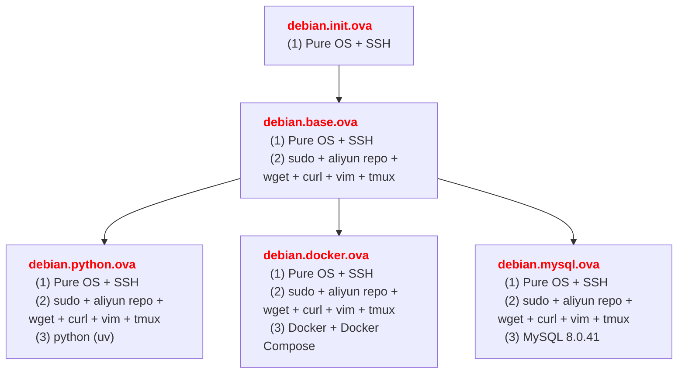

<h1>Debian 12</h1>

<details>
<summary>VirtualBox ova</summary>



</details>

<details>
<summary>一键 配置 / 安装 脚本</summary>

```bash
wget https://gitee.com/haroldzkx/repo/releases/download/debian/debian.base.sh
wget https://gitee.com/haroldzkx/repo/releases/download/debian/debian.docker.sh
wget https://gitee.com/haroldzkx/repo/releases/download/debian/debian.python.sh

su root
chmod +x debian.base.sh debian.docker.sh debian.python.sh

./debian.bash.sh
./debian.docker.sh
./debian.python.sh
```

</details>

# System Config

<details>
<summary>Grant sudo to User</summary>

```bash
su root

# 1.Add auth
ls -l /etc/sudoers && chmod +w /etc/sudoers

# 2.Edit File
vi /etc/sudoers

#   Add Below Content
Username	ALL=(ALL:ALL) ALL

# 3.delete auth after update file
chmod -w /etc/sudoers && ls -l /etc/sudoers

# 4.logout current user and relogin
```

```shell
#!/bin/bash

# Ensure the script is run as the root user
if [ "$EUID" -ne 0 ]; then
  echo "Please run this script as root"
  exit
fi

# 1. Add permissions
echo "Adding write permission to /etc/sudoers"
chmod +w /etc/sudoers

# 2. Modify content
echo "Modifying /etc/sudoers file"
echo "Please enter the username to add sudo permission:"
read Username

# Check if the user already exists in the sudoers file
if grep -q "^$Username" /etc/sudoers; then
  echo "User $Username already exists in the sudoers file."
else
  echo "$Username\tALL=(ALL:ALL) ALL" >> /etc/sudoers
  echo "User $Username has been added to the sudoers file."
fi

# 3. Remove permissions after modification
echo "Removing write permission from /etc/sudoers"
chmod -w /etc/sudoers

# 4. Show the permissions after modification
ls -l /etc/sudoers

echo "Please log out and log back in to apply the changes."
```

</details>

<details>
<summary>Change Source</summary>

<details>
<summary>0.命令脚本</summary>

```shell
#!/bin/bash

# Backup the original sources.list file
cp /etc/apt/sources.list /etc/apt/sources.list.backup

# Comment out all lines in the sources.list file and add the new repositories
sed -i -e 's/^/#/' /etc/apt/sources.list
bash -c 'cat << EOF >> /etc/apt/sources.list
deb https://mirrors.aliyun.com/debian/ bookworm main non-free non-free-firmware contrib
deb-src https://mirrors.aliyun.com/debian/ bookworm main non-free non-free-firmware contrib
deb https://mirrors.aliyun.com/debian-security/ bookworm-security main
deb-src https://mirrors.aliyun.com/debian-security/ bookworm-security main
deb https://mirrors.aliyun.com/debian/ bookworm-updates main non-free non-free-firmware contrib
deb-src https://mirrors.aliyun.com/debian/ bookworm-updates main non-free non-free-firmware contrib
deb https://mirrors.aliyun.com/debian/ bookworm-backports main non-free non-free-firmware contrib
deb-src https://mirrors.aliyun.com/debian/ bookworm-backports main non-free non-free-firmware contrib
EOF'

# Update the package lists
apt update
```

```bash
sudo vi /etc/apt/sources.list

# Comment the file contents and add the following content, you can choose any

sudo apt update
```

</details>

<details>
<summary>1.Aliyun</summary>

```bash
deb https://mirrors.aliyun.com/debian/ bookworm main non-free non-free-firmware contrib
deb-src https://mirrors.aliyun.com/debian/ bookworm main non-free non-free-firmware contrib
deb https://mirrors.aliyun.com/debian-security/ bookworm-security main
deb-src https://mirrors.aliyun.com/debian-security/ bookworm-security main
deb https://mirrors.aliyun.com/debian/ bookworm-updates main non-free non-free-firmware contrib
deb-src https://mirrors.aliyun.com/debian/ bookworm-updates main non-free non-free-firmware contrib
deb https://mirrors.aliyun.com/debian/ bookworm-backports main non-free non-free-firmware contrib
deb-src https://mirrors.aliyun.com/debian/ bookworm-backports main non-free non-free-firmware contrib
```

</details>

<details>
<summary>2.USTC</summary>

```bash
deb https://mirrors.ustc.edu.cn/debian/ bookworm main non-free non-free-firmware contrib
deb-src https://mirrors.ustc.edu.cn/debian/ bookworm main non-free non-free-firmware contrib
deb https://mirrors.ustc.edu.cn/debian-security/ bookworm-security main
deb-src https://mirrors.ustc.edu.cn/debian-security/ bookworm-security main
deb https://mirrors.ustc.edu.cn/debian/ bookworm-updates main non-free non-free-firmware contrib
deb-src https://mirrors.ustc.edu.cn/debian/ bookworm-updates main non-free non-free-firmware contrib
deb https://mirrors.ustc.edu.cn/debian/ bookworm-backports main non-free non-free-firmware contrib
deb-src https://mirrors.ustc.edu.cn/debian/ bookworm-backports main non-free non-free-firmware contrib
```

</details>

<details>
<summary>3.Netease</summary>

```bash
deb https://mirrors.163.com/debian/ bookworm main non-free non-free-firmware contrib
deb-src https://mirrors.163.com/debian/ bookworm main non-free non-free-firmware contrib
deb https://mirrors.163.com/debian-security/ bookworm-security main
deb-src https://mirrors.163.com/debian-security/ bookworm-security main
deb https://mirrors.163.com/debian/ bookworm-updates main non-free non-free-firmware contrib
deb-src https://mirrors.163.com/debian/ bookworm-updates main non-free non-free-firmware contrib
deb https://mirrors.163.com/debian/ bookworm-backports main non-free non-free-firmware contrib
deb-src https://mirrors.163.com/debian/ bookworm-backports main non-free non-free-firmware contrib
```

</details>

<details>
<summary>4.Tencent</summary>

```bash
deb https://mirrors.cloud.tencent.com/debian/ bookworm main non-free non-free-firmware contrib
deb-src https://mirrors.cloud.tencent.com/debian/ bookworm main non-free non-free-firmware contrib
deb https://mirrors.cloud.tencent.com/debian-security/ bookworm-security main
deb-src https://mirrors.cloud.tencent.com/debian-security/ bookworm-security main
deb https://mirrors.cloud.tencent.com/debian/ bookworm-updates main non-free non-free-firmware contrib
deb-src https://mirrors.cloud.tencent.com/debian/ bookworm-updates main non-free non-free-firmware contrib
deb https://mirrors.cloud.tencent.com/debian/ bookworm-backports main non-free non-free-firmware contrib
deb-src https://mirrors.cloud.tencent.com/debian/ bookworm-backports main non-free non-free-firmware contrib
```

</details>

</details>

<details>
<summary>python-pip</summary>

Default with python3.11, But don't have pip tool

```bash
sudo apt install python3-pip

# install complete python environment,
# create virtual env need python3-full
sudo apt install python3-full
python3 -m venv XXX
```

</details>

<details>
<summary>Remote Desktop Access</summary>

```bash
# Install XRDP
sudo apt update
sudo apt install xrdp

# Launch XRDP service and check status
sudo systemctl enable --now xrdp
systemctl status xrdp --no-pager -l

# Add XRDP user to SSL-Cert Group
# Need to add XRDP user to SSL-cert group that can connect successful
# or Will show blank screen When after establish the connection
sudo adduser xrdp ssl-cert

# reboot XRDP service
sudo systemctl restart xrdp

# Pass port in Firewall
sudo ufw allow 3389

# Recommand: create new user for remote desktop login
```

```bash
sudo apt install krdc freerdp2-wayland
```

</details>

<details>
<summary>Change Hostname</summary>

```bash
sudo vim /etc/hostname
sudo vim /etc/hosts
```

</details>

<details>
<summary>Uninstall LibreOffice</summary>

```bash
# don't lose "*" and "?", or can't clear All LibreOffice
sudo apt-get purge libreoffice?
sudo aptitude purge libreoffice?
sudo apt-get remove --purge libreoffice*

# clear the unused package
sudo apt-get clean
sudo apt-get autoremove
```

</details>

<details>
<summary>Install GPU Driver</summary>

```bash
sudo apt install nvidia-detect
sudo nvidia-detect

sudo apt install nvidia-driver
reboot
```

</details>

<details>
<summary>.bashrc</summary>

```bash
# python
alias python='/usr/bin/python3'
alias pip="/usr/bin/pip3"
export pybfsu=https://mirrors.bfsu.edu.cn/pypi/web/simple
export pyustc=https://mirrors.ustc.edu.cn/pypi/simple

# system
alias sb='source /home/pc/.bashrc'

# list directory
alias la='ls -a'
alias ll='ls -l'
alias llh='ls -lh'
alias list='ls -lha'

# docker
alias d='docker'
alias di='docker images'
alias dil='docker images | sed "s|registry.cn-shenzhen.aliyuncs.com/haroldfinch|\$ali|g"'
alias drm='docker rm'
alias drmi='docker rmi'
alias drmf='docker rm -f'
alias dps='docker ps'
alias dpsa='docker ps -a'

export ali=registry.cn-shenzhen.aliyuncs.com/haroldfinch

alias dif='docker images --format "\nRepository: {{.Repository}}\nTag: {{.Tag}}\nImage ID: {{.ID}}\nCreated: {{.CreatedAt}}\nSize: {{.Size}}" | sed "s|registry.cn-shenzhen.aliyuncs.com/haroldfinch|\$ali|g"'

alias dpsal='docker ps -a --format "\nContainer ID: {{.ID}}\nImage: {{.Image}}\nCommand: {{.Command}}\nCreated: {{.CreatedAt}}\nStatus: {{.Status}}\nPorts: {{.Ports}}\nContainer Name: {{.Names}}\n"'
alias dpsl='docker ps --format "\nContainer ID: {{.ID}}\nImage: {{.Image}}\nCommand: {{.Command}}\nCreated: {{.CreatedAt}}\nStatus: {{.Status}}\nPorts: {{.Ports}}\nContainer Name: {{.Names}}\n"'

# **************** Below config can't Verified, Be Careful ***************
# set the terminal colorful
export CLICOLOR=1
export LSCOLORS=Gxfxcxdxcxegedabagacad
export PS1="%n@%10F%m%f:%11F%0~%f \$ "

# custom color
autoload -U colors && colors

# Show Git Branch
function parse_git_branch() {
    git branch 2> /dev/null | sed -n -e 's/^\* \(.*\)/[\1]/p'
}
setopt PROMPT_SUBST

# Config Prompt Color
#export PROMPT='%F{green}%n@%m:%F{cyan}%~%F{green}$(parse_git_branch)%F{white}$ '
export PROMPT='%F{green}%n@%m:%F{cyan}%~%F{green}$(parse_git_branch)%F{white}
$ '
```

</details>

<details>
<summary>locale</summary>

```bash
-bash: warning: setlocale: LC_ALL: cannot change locale (en_US.UTF-8)
```

```bash
# if face the above error, use the below command,
# choose en_US.UTF-8 to regenerate language package
sudo dpkg-reconfigure locales
```

</details>

<details>
<summary>Upgrade OS Version</summary>

Upgrade Minor Version: From 12.10 to 12.11
Upgrade Major Version: From 11 to 12

```bash
sudo apt update
sudo apt upgrade
sudo apt full-upgrade
sudo apt autoremove
sudo apt clean
sudo reboot

# Check Major and Minor Version
cat /etc/debian_version
lsb_release -a
```

</details>

# Software

<details>
<summary>PgyVisitor</summary>

```bash
# download
wget https://pgy.oray.com/softwares/153/download/2156/PgyVisitor_6.2.0_x86_64.deb
mv PgyVisitor_6.2.0_x86_64.deb ~/Downloads/

# install
dpkg -i PgyVisitor_6.2.0_x86_64.deb

# check install and exec status
sudo systemctl status pgyvpn
dpkg -l | grep pgyvpn

# check install path info
find / -name pgyvpn 2>/dev/null
find / -name pgyvisitor 2>/dev/null

# give soft link
sudo ln -s /usr/sbin/pgyvisitor /usr/local/bin/pgyvisitor

# software setting
pgyvisitor login -u ACCOUNT -p PASSWORD
pgyvisitor logininfo
pgyvisitor autologin -y
pgyvisitor showsets
pgyvisitor getmbrs -m
```

</details>

<details>
<summary>Tailscale</summary>

```bash
curl -fsSL https://tailscale.com/install.sh | sh
sudo tailscale up
```

</details>

<details>
<summary>Docker Install</summary>

```bash
# update system package and install necessary tools
sudo apt update
sudo apt upgrade -y
sudo apt install apt-transport-https ca-certificates curl software-properties-common -y

# Add Docker Official GPG Key (Download from Aliyun)
sudo curl -fsSL https://mirrors.aliyun.com/docker-ce/linux/debian/gpg | sudo gpg --dearmor -o /usr/share/keyrings/docker-archive-keyring.gpg

# Add Aliyun Docker Software Source
# echo "deb [arch=amd64 signed-by=/usr/share/keyrings/docker-archive-keyring.gpg] https://mirrors.aliyun.com/docker-ce/linux/debian $(lsb_release -cs) stable" | sudo tee /etc/apt/sources.list.d/docker.list > /dev/null
echo "deb [arch=amd64 signed-by=/usr/share/keyrings/docker-archive-keyring.gpg] https://mirrors.aliyun.com/docker-ce/linux/debian $(lsb_release -cs) stable" | sudo tee /etc/apt/sources.list.d/docker.list

sudo apt update

# install Docker
sudo apt install docker-ce docker-ce-cli containerd.io docker-compose-plugin

# launch and config Docker start at boot
sudo systemctl start docker
sudo systemctl enable docker

# Verify Docker install is success
docker --version

# Add current user to Docker Group (Optional)
sudo usermod -aG docker $USER
# and then logout current user and relogin

# Verify Docker Service
sudo systemctl status docker
```

</details>

<details>
<summary>Docker Uninstall</summary>

```bash
# Uninstall Docker Package and Dependencies
sudo apt purge docker-ce docker-ce-cli containerd.io docker-compose-plugin

# Delete Docker Configure file and data directory
## delete Docker config and data dir
sudo rm -rf /var/lib/docker
sudo rm -rf /etc/docker
## delete Docker configure file
sudo rm -rf /etc/systemd/system/docker.service.d
sudo rm -rf /etc/apt/sources.list.d/docker.list
## delete Docker GPG key
sudo rm -f /usr/share/keyrings/docker-archive-keyring.gpg

# clear unused dependency
sudo apt autoremove --purge
sudo apt clean

# Update apt source
sudo apt-get update

# ensure uninstall Docker competely
docker --version
```

</details>

<details>
<summary>Skopeo</summary>

```bash
sudo apt install skopeo
```

</details>

<details>
<summary>vim</summary>

```shell
set showmatch         " Highlight parentheses

set number            " set line number

set cindent           " C-style indent

set autoindent

set tabstop=4         " set tab width
set softtabstop=4
set shiftwidth=4      " The uniform indentation is 4

syntax on
```

</details>

<details>
<summary>tmux</summary>

```powershell
# set scroll screen like vim
setw -g mode-keys vi

# session index from 1
set -g base-index 1

# pane index from 1, not 0
set -g pane-base-index 1

# vim style to move cursor in pane
bind h select-pane -L
bind j select-pane -D
bind k select-pane -U
bind l select-pane -R
```

```bash
tmux source-file ~/.tmux.conf
```

</details>

<details>
<summary>fcitx5</summary>

```bash
# Uninstall old input method
sudo apt purge fcitx* ibus*

# Install
sudo apt install fcitx5 fcitx5-chinese-addons fcitx5-pinyin

sudo reboot
```

</details>

# shell

<details>
<summary>debian.base.sh</summary>

```bash
#!/bin/bash

set -euo pipefail
IFS=$'\n\t'

# Output colors
RED='\033[0;31m'
GREEN='\033[0;32m'
YELLOW='\033[1;33m'
PLAIN='\033[0m'

# Check for root
check_root() {
  if [[ "$EUID" -ne 0 ]]; then
    printf "${RED}Please use root to run this script (sudo bash bash.sh)${PLAIN}\n" >&2
    return 1
  fi
}

check_user_exists() {
  local user="$1"
  if ! id "$user" &>/dev/null; then
    printf "${RED}User [ %s ] Not Exists ${PLAIN}\n" "$user" >&2
    return 1
  fi
}

install_sudo_if_missing() {
  if ! command -v sudo &>/dev/null; then
    printf "${YELLOW}Not Found [ sudo ]，try to install it...${PLAIN}\n"
    if command -v apt &>/dev/null; then
      apt update && apt install -y sudo
    elif command -v yum &>/dev/null; then
      yum install -y sudo
    elif command -v dnf &>/dev/null; then
      dnf install -y sudo
    else
      printf "${RED}Cann't install sudo automatically, Please install sudo by yourself.${PLAIN}\n" >&2
      return 1
    fi
  fi
}

add_sudo_user() {
  local username="happy"

  if ! check_user_exists "$username"; then
    return 1
  fi

  if grep -Eq "^$username\s+ALL=\(ALL(:ALL)?\)\s+ALL" /etc/sudoers; then
    printf "${GREEN}User %s has exist in sudoers ${PLAIN}\n" "$username"
    return 0
  fi

  chmod +w /etc/sudoers

  if ! printf "%s\tALL=(ALL:ALL) ALL\n" "$username" >> /etc/sudoers; then
    printf "${RED}Add sudo permissions [ FAILED ]. ${PLAIN}\n" >&2
    chmod -w /etc/sudoers
    return 1
  fi

  chmod -w /etc/sudoers
  printf "${GREEN}Add sudo permissions for %s [ SUCCESS ]${PLAIN}\n" "$username"
}

check_user_home() {
  local user="happy"
  local home_dir; home_dir=$(eval echo "~$user")

  if [[ ! -d "$home_dir" ]]; then
    printf "${RED}User %s home directory not exist: %s${PLAIN}\n" "$user" "$home_dir" >&2
    return 1
  fi

  printf "%s\n" "$home_dir"
}

create_bash_aliases() {
  local user="happy"
  local home_dir; home_dir=$(check_user_home) || return 1
  local alias_file="$home_dir/.bash_aliases"

  cat > "$alias_file" << 'EOF'
# python
export pybfsu=https://mirrors.bfsu.edu.cn/pypi/web/simple
export pyustc=https://mirrors.ustc.edu.cn/pypi/simple

# system
alias sb='source /home/happy/.bashrc'

# list directory
alias la='ls -a'
alias ll='ls -l'
alias llh='ls -lh'
alias list='ls -lha'
EOF

  chown "$user":"$user" "$alias_file"
  chmod 644 "$alias_file"
  printf "${GREEN}.bash_aliases has created: %s${PLAIN}\n" "$alias_file"
}

# Backup and replace APT source with Aliyun mirror
add_aliyun_source() {
  local source_file="/etc/apt/sources.list"
  local backup_file="/etc/apt/sources.list.backup"

  if [[ ! -f "$source_file" ]]; then
    printf "${RED}Not Found the file [sources.list]: %s${PLAIN}\n" "$source_file" >&2
    return 1
  fi

  cp "$source_file" "$backup_file"

  if ! sed -i -e 's/^[^#]/#&/' "$source_file"; then
    printf "${RED}Failed to Comment on the original source${PLAIN}\n" >&2
    return 1
  fi

  cat << 'EOF' >> "$source_file"
deb https://mirrors.aliyun.com/debian/ bookworm main non-free non-free-firmware contrib
deb-src https://mirrors.aliyun.com/debian/ bookworm main non-free non-free-firmware contrib
deb https://mirrors.aliyun.com/debian-security/ bookworm-security main
deb-src https://mirrors.aliyun.com/debian-security/ bookworm-security main
deb https://mirrors.aliyun.com/debian/ bookworm-updates main non-free non-free-firmware contrib
deb-src https://mirrors.aliyun.com/debian/ bookworm-updates main non-free non-free-firmware contrib
deb https://mirrors.aliyun.com/debian/ bookworm-backports main non-free non-free-firmware contrib
deb-src https://mirrors.aliyun.com/debian/ bookworm-backports main non-free non-free-firmware contrib
EOF

  if ! apt update; then
    printf "${RED}Update Software Package Lists [ FAIL ]${PLAIN}\n" >&2
    return 1
  fi

  printf "${GREEN}Update Software Package Lists [ SUCCESS ], Add aliyun mirror.${PLAIN}\n"
}

install_vim() {
  if command -v vim &>/dev/null; then
    printf "${YELLOW}Vim has installed, skip this step.${PLAIN}\n"
    return 0
  fi

  if command -v apt &>/dev/null; then
    apt update && apt install -y vim
  elif command -v yum &>/dev/null; then
    yum install -y vim
  elif command -v dnf &>/dev/null; then
    dnf install -y vim
  else
    printf "${RED}Unrecongnized package install manager, can't install vim${PLAIN}\n" >&2
    return 1
  fi

  printf "${GREEN}Install Vim [ SUCCESS ]${PLAIN}\n"
}

create_vimrc() {
  local user="happy"
  local home_dir; home_dir=$(eval echo "~$user")

  if [[ ! -d "$home_dir" ]]; then
    printf "${RED}User %s home directory doesn't exist: %s${PLAIN}\n" "$user" "$home_dir" >&2
    return 1
  fi

  local vimrc_file="$home_dir/.vimrc"

  cat > "$vimrc_file" << 'EOF'
set showmatch         " Highlight parentheses

set number            " set line number

set cindent           " C-style indent

set autoindent

set tabstop=4         " set tab width
set softtabstop=4
set shiftwidth=4      " The uniform indentation is 4

syntax on
EOF

  chown "$user":"$user" "$vimrc_file"
  chmod 644 "$vimrc_file"
  printf "${GREEN}.vimrc created SUCCESS: %s${PLAIN}\n" "$vimrc_file"
}

install_tmux() {
  if command -v tmux &>/dev/null; then
    printf "${YELLOW}tmux has installed, skip this step.${PLAIN}\n"
    return 0
  fi

  if command -v apt &>/dev/null; then
    apt update && apt install -y tmux
  elif command -v yum &>/dev/null; then
    yum install -y tmux
  elif command -v dnf &>/dev/null; then
    dnf install -y tmux
  else
    printf "${RED}Unrecongnized package install manager, can't install tmux${PLAIN}\n" >&2
    return 1
  fi

  printf "${GREEN}Install tmux [ SUCCESS ]${PLAIN}\n"
}

create_tmux_conf() {
  local user="happy"
  local home_dir; home_dir=$(eval echo "~$user")
  local conf_file="$home_dir/.tmux.conf"

  if [[ ! -d "$home_dir" ]]; then
    printf "${RED}User %s home directory doesn't exist: %s${PLAIN}\n" "$user" "$home_dir" >&2
    return 1
  fi

  cat > "$conf_file" << 'EOF'
# set scroll screen like vim
setw -g mode-keys vi

# session index from 1
set -g base-index 1

# pane index from 1, not 0
set -g pane-base-index 1

# vim style to move cursor in pane
bind h select-pane -L
bind j select-pane -D
bind k select-pane -U
bind l select-pane -R
EOF

  chown "$user":"$user" "$conf_file"
  chmod 644 "$conf_file"
  printf "${GREEN}.tmux.conf created SUCCESS: %s${PLAIN}\n" "$conf_file"
}

apply_tmux_config() {
  local user="happy"
  local home_dir; home_dir=$(eval echo "~$user")
  local conf_file="$home_dir/.tmux.conf"

  if [[ ! -f "$conf_file" ]]; then
    printf "${RED}Not Found %s Configure file, can't load ${PLAIN}\n" "$conf_file" >&2
    return 1
  fi

  if ! su - "$user" -c "tmux new-session -d -s __config_loader && tmux source-file '$conf_file' && tmux kill-session -t __config_loader"; then
    printf "${RED}Load tmux config [ FAILED ]${PLAIN}\n" >&2
    return 1
  fi

  printf "${GREEN}Load tmux config [ SUCCESS ] %s${PLAIN}\n" "$conf_file"
}

install_curl() {
  if command -v curl &>/dev/null; then
    printf "${YELLOW}curl has installed, skip this step.${PLAIN}\n"
    return 0
  fi

  if command -v apt &>/dev/null; then
    apt update && apt install -y curl
  elif command -v yum &>/dev/null; then
    yum install -y curl
  elif command -v dnf &>/dev/null; then
    dnf install -y curl
  else
    printf "${RED}Unrecongnized package install manager, can't install curl${PLAIN}\n" >&2
    return 1
  fi

  printf "${GREEN}Install curl [ SUCCESS ]${PLAIN}\n"
}

main() {
  if ! check_root; then
    return 1
  fi

  if ! add_aliyun_source; then
    return 1
  fi

  if ! install_sudo_if_missing; then
    return 1
  fi

  if ! add_sudo_user; then
    return 1
  fi

  if ! create_bash_aliases; then
    return 1
  fi

  if ! install_vim; then
    return 1
  fi

  if ! create_vimrc; then
    return 1
  fi

  if ! install_tmux; then
    return 1
  fi

  if ! create_tmux_conf; then
    return 1
  fi

  if ! apply_tmux_config; then
    return 1
  fi

  if ! install_curl; then
    return 1
  fi
}

main
```

</details>


<details>
<summary>debian.docker.sh</summary>

```bash
#!/bin/bash

set -euo pipefail
IFS=$'\n\t'

RED='\033[0;31m'
GREEN='\033[0;32m'
YELLOW='\033[1;33m'
PLAIN='\033[0m'

check_root() {
  if [[ "$EUID" -ne 0 ]]; then
    printf "${RED}Please run this script as root (sudo bash install_docker.sh)${PLAIN}\n" >&2
    return 1
  fi
}

update_system() {
  apt update
  apt upgrade -y
  apt install -y apt-transport-https ca-certificates curl software-properties-common gnupg lsb-release
  printf "${GREEN}System packages updated and dependencies installed${PLAIN}\n"
}

add_docker_gpg_key() {
  local keyring="/usr/share/keyrings/docker-archive-keyring.gpg"

  if ! curl -fsSL https://mirrors.aliyun.com/docker-ce/linux/debian/gpg | gpg --dearmor -o "$keyring"; then
    printf "${RED}Failed to download Docker GPG key${PLAIN}\n" >&2
    return 1
  fi

  chmod 644 "$keyring"
  printf "${GREEN}Docker GPG key added: %s${PLAIN}\n" "$keyring"
}

add_docker_repo() {
  local distro; distro=$(lsb_release -cs)
  local source_file="/etc/apt/sources.list.d/docker.list"
  local entry="deb [arch=amd64 signed-by=/usr/share/keyrings/docker-archive-keyring.gpg] https://mirrors.aliyun.com/docker-ce/linux/debian ${distro} stable"

  echo "$entry" > "$source_file"
  chmod 644 "$source_file"

  apt update
  printf "${GREEN}Docker repository added and package list updated${PLAIN}\n"
}

install_docker() {
  apt install -y docker-ce docker-ce-cli containerd.io docker-compose-plugin
  printf "${GREEN}Docker installation completed${PLAIN}\n"
}

enable_and_start_docker() {
  systemctl enable docker
  systemctl start docker
  printf "${GREEN}Docker started and enabled on boot${PLAIN}\n"
}

verify_docker() {
  if ! docker --version &>/dev/null; then
    printf "${RED}Docker installation verification failed${PLAIN}\n" >&2
    return 1
  fi

  docker --version
}

# add_user_to_docker_group() {
#   local user="happy"

#   if ! id "$user" &>/dev/null; then
#     printf "${RED}User %s does not exist, cannot add to docker group${PLAIN}\n" "$user" >&2
#     return 1
#   fi

#   usermod -aG docker "$user"
#   printf "${YELLOW}User %s added to docker group. Please log out and log back in to apply changes.${PLAIN}\n" "$user"
# }

add_user_to_docker_group() {
  local user="happy"
  local group_file="/etc/group"

  if ! id "$user" &>/dev/null; then
    printf "${RED}User %s does not exist, cannot add to docker group${PLAIN}\n" "$user" >&2
    return 1
  fi

  if ! getent group docker &>/dev/null; then
    if ! groupadd docker; then
      printf "${RED}Failed to create docker group${PLAIN}\n" >&2
      return 1
    fi
  fi

  if ! sudo usermod -aG docker "$user"; then
    printf "${RED}Failed to add user %s to docker group${PLAIN}\n" "$user" >&2
    return 1
  fi

  local socket="/var/run/docker.sock"
  if [[ -S "$socket" ]]; then
    if ! chgrp docker "$socket"; then
      printf "${RED}Failed to set docker.sock group to docker${PLAIN}\n" >&2
      return 1
    fi

    if ! chmod 660 "$socket"; then
      printf "${RED}Failed to set permissions on docker.sock${PLAIN}\n" >&2
      return 1
    fi
  fi

  local pam_file="/etc/pam.d/su"
  if ! grep -q "^auth.*required.*pam_wheel.so" "$pam_file"; then
    printf "${YELLOW}Warning: pam_wheel not configured, this may affect group membership recognition${PLAIN}\n" >&2
  fi

  if ! su - "$user" -c "newgrp docker <<<'docker info' &>/dev/null"; then
    printf "${RED}Failed to apply new group in subshell. Docker command may still require sudo for user %s${PLAIN}\n" "$user" >&2
    return 1
  fi

  printf "${GREEN}User %s added to docker group and group permissions applied immediately${PLAIN}\n" "$user"
}

append_docker_aliases() {
  local user="happy"
  local home_dir; home_dir=$(eval echo "~$user")
  local alias_file="$home_dir/.bash_aliases"

  if [[ ! -f "$alias_file" ]]; then
    touch "$alias_file"
    chown "$user":"$user" "$alias_file"
    chmod 644 "$alias_file"
  fi

  cat >> "$alias_file" << 'EOF'

# docker
alias d='docker'
alias di='docker images'
alias dil='docker images | sed "s|registry.cn-shenzhen.aliyuncs.com/haroldfinch|\$ali|g"'
alias drm='docker rm'
alias drmi='docker rmi'
alias drmf='docker rm -f'
alias dps='docker ps'
alias dpsa='docker ps -a'

export ali=registry.cn-shenzhen.aliyuncs.com/haroldfinch

alias dif='docker images --format "\nRepository: {{.Repository}}\nTag: {{.Tag}}\nImage ID: {{.ID}}\nCreated: {{.CreatedAt}}\nSize: {{.Size}}" | sed "s|registry.cn-shenzhen.aliyuncs.com/haroldfinch|\$ali|g"'

alias dpsal='docker ps -a --format "\nContainer ID: {{.ID}}\nImage: {{.Image}}\nCommand: {{.Command}}\nCreated: {{.CreatedAt}}\nStatus: {{.Status}}\nPorts: {{.Ports}}\nContainer Name: {{.Names}}\n"'
alias dpsl='docker ps --format "\nContainer ID: {{.ID}}\nImage: {{.Image}}\nCommand: {{.Command}}\nCreated: {{.CreatedAt}}\nStatus: {{.Status}}\nPorts: {{.Ports}}\nContainer Name: {{.Names}}\n"'
EOF

  chown "$user":"$user" "$alias_file"

  if ! su - "$user" -c "source /home/happy/.bashrc"; then
    printf "${RED}Failed to execute source ~/.bashrc, it may not take effect. Please run manually.${PLAIN}\n" >&2
    return 1
  fi

  printf "${GREEN}Docker aliases appended and loaded successfully${PLAIN}\n"
}

main() {
  if ! check_root; then
    return 1
  fi

  if ! update_system; then
    return 1
  fi

  if ! add_docker_gpg_key; then
    return 1
  fi

  if ! add_docker_repo; then
    return 1
  fi

  if ! install_docker; then
    return 1
  fi

  if ! enable_and_start_docker; then
    return 1
  fi

  if ! verify_docker; then
    return 1
  fi

  if ! add_user_to_docker_group; then
    return 1
  fi

  if ! append_docker_aliases; then
    return 1
  fi
}

main
```

</details>

<details>
<summary>debian.python.sh</summary>

```bash
#!/bin/bash

set -euo pipefail
IFS=$'\n\t'

USER_NAME="happy"
HOME_DIR="/home/${USER_NAME}"
UV_VERSION="0.8.12"

extract_uv_python_metadata() {
  local version="$1"
  local output; output=$(uv python install --mirror file:///home "$version" 2>&1 || true)

  local date; date=$(grep -oP 'file `/home/\K[0-9]{8}(?=/cpython-)' <<< "$output")
  local filename; filename=$(grep -oP 'file `/home/.+?/(\Kcpython-[^`]+)' <<< "$output")

  if [[ -z "$date" || -z "$filename" ]]; then
    return 1
  fi

  printf "%s|%s|%s\n" "$version" "$date" "$filename"
}

get_cpython_versions() {
  local min_minor="$1"
  local max_minor="$2"

  local versions_raw; versions_raw=$(uv python list 2>/dev/null | grep '^cpython-[0-9]' || true)
  if [[ -z "$versions_raw" ]]; then
    return 1
  fi

  local version_lines; version_lines=$(awk '{print $1}' <<< "$versions_raw")

  awk -v min="$min_minor" -v max="$max_minor" -F'-' '
    /^[^+]+$/ {
      ver = $2
      split(ver, parts, ".")
      major = parts[1]
      minor = parts[2]
      patch = parts[3]

      if ((major == 3) && (minor >= min) && (minor <= max)) {
        key = major "." minor
        if (!(key in latest) || compare(ver, latest[key]) > 0) {
          latest[key] = ver
        }
      }
    }
    function compare(v1, v2,  a, b, i) {
      split(v1, a, ".")
      split(v2, b, ".")
      for (i = 1; i <= 3; i++) {
        if (a[i]+0 > b[i]+0) return 1
        if (a[i]+0 < b[i]+0) return -1
      }
      return 0
    }
    END {
      for (k in latest) {
        print latest[k]
      }
    }
  ' <<< "$version_lines" | sort -Vu
}

download_and_install_python() {
  local version="$1"
  local date="$2"
  local filename="$3"
  local target_dir="${HOME_DIR}/${date}"
  local download_url="https://github.com/astral-sh/python-build-standalone/releases/download/${date}/${filename}"
  local mirror_path="file://${HOME_DIR}"

  mkdir -p "$target_dir"

  if ! wget -O "${target_dir}/${filename}" "$download_url"; then
    printf "Failed to download %s\n" "$download_url" >&2
    return 1
  fi

  if ! su - "${USER_NAME}" -c "uv python install --mirror ${mirror_path} ${version}"; then
    printf "Failed to install Python %s from mirror\n" "$version" >&2
    return 1
  fi

  printf "Python %s installed successfully from %s\n" "$version" "$filename"
}

install_all_versions() {
  # set python version from 3.8 to 3.12
  local min_minor=8
  local max_minor=12

  local versions; versions=$(get_cpython_versions "$min_minor" "$max_minor")
  local version line

  while IFS= read -r version; do
    if ! line=$(extract_uv_python_metadata "$version"); then
      continue
    fi

    IFS='|' read -r ver date filename <<< "$line"
    download_and_install_python "$ver" "$date" "$filename" || continue
  done <<< "$versions"
}

install_uv_offline() {
  local uv_archive="uv-x86_64-unknown-linux-gnu.tar.gz"
  local uv_url="https://github.com/astral-sh/uv/releases/download/${UV_VERSION}/${uv_archive}"
  local install_dir="/usr/local"
  local binary_name="uv-x86_64-unknown-linux-gnu"
  local target_dir="${install_dir}/uv"
  local bashrc_file="${HOME_DIR}/.bashrc"

  cd ${HOME_DIR}

  if ! wget -O "$uv_archive" "$uv_url"; then
    printf "Failed to download UV archive: %s\n" "$uv_url" >&2
    return 1
  fi

  tar -xzf "${HOME_DIR}/$uv_archive" -C "$install_dir"
  mv "${install_dir}/${binary_name}" "$target_dir"

  if [[ ! -x "${target_dir}/uv" ]]; then
    printf "UV binary not found or not executable at: %s\n" "${target_dir}/uv" >&2
    return 1
  fi

  printf 'export PATH="/usr/local/uv:$PATH"\n' >> "$bashrc_file"
  printf 'export PATH="%s/.local/bin:$PATH"\n' "$HOME_DIR" >> "$bashrc_file"

  chown "$USER_NAME:$USER_NAME" "$bashrc_file"

  su - "$USER_NAME" -c "source ${HOME_DIR}/.bashrc"

  if ! su - "$USER_NAME" -c "command -v uv &>/dev/null"; then
    printf "UV not found in PATH after installation\n" >&2
    return 1
  fi

  printf "UV %s installed successfully at %s\n" "$UV_VERSION" "$target_dir"
}

main() {
  install_uv_offline
  install_all_versions
}

main
```

</details>