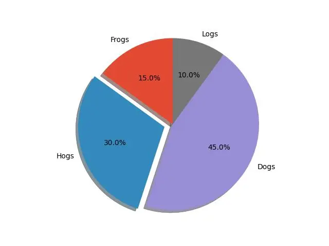
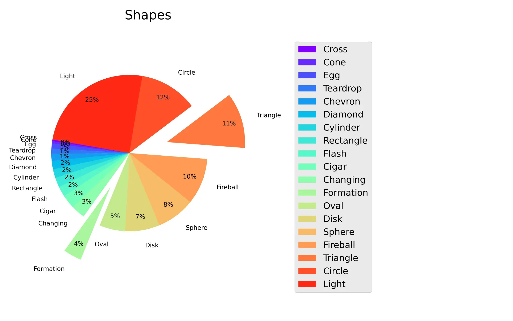
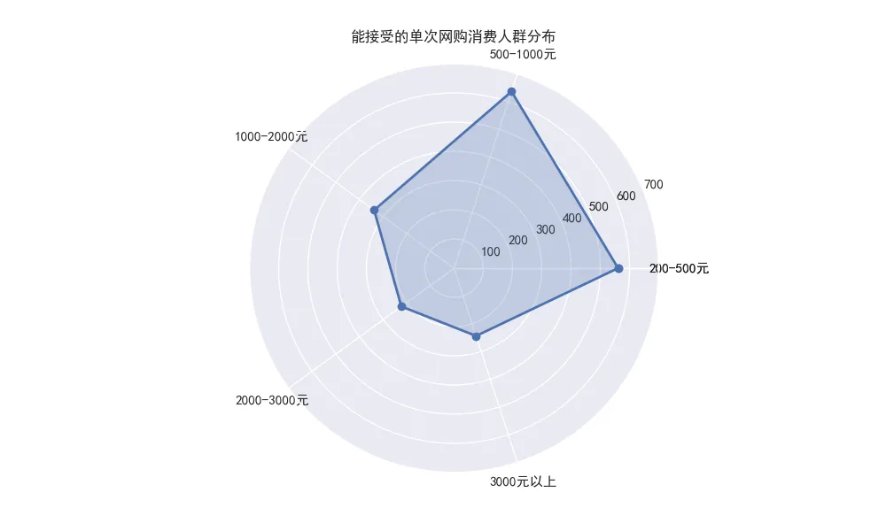

# matplotlib 中文乱码问题解决

可以从这三个路径下载中文字体文件 SimHei.ttf 放到项目目录中

```bash
wget -O SimHei.ttf "https://www.wfonts.com/download/data/2014/06/01/simhei/chinese.simhei.ttf"
# 或
wget -O SimHei.ttf "https://github.com/StellarCN/scp_zh/blob/master/fonts/SimHei.ttf"

wget -O SimHei.ttf "https://gitee.com/haroldzkx/repo/releases/download/matplotlib.font/SimHei.ttf"
```

在绘图代码前添加如下代码就可使用中文字体

```python
import matplotlib
​
# 添加下载的字体文件
matplotlib.font_manager.fontManager.addfont('./SimHei.ttf')
​
# 设置 Matplotlib 使用 SimHei 字体
matplotlib.rc('font', family='SimHei')
# 或者添加如下代码
plt.rc('font', family='SimHei')
```

# 饼图

## 官方 Demo

```python
import matplotlib.pyplot as plt

# Pie chart, where the slices will be ordered and plotted counter-clockwise:
labels = 'Frogs', 'Hogs', 'Dogs', 'Logs'
sizes = [15, 30, 45, 10]
explode = (0, 0.1, 0, 0)  # only "explode" the 2nd slice (i.e. 'Hogs')

fig1, ax1 = plt.subplots()
ax1.pie(sizes, explode=explode, labels=labels, autopct='%1.1f%%',
        shadow=True, startangle=90)
ax1.axis('equal')  # Equal aspect ratio ensures that pie is drawn as a circle.

plt.savefig('Demo_official.jpg')
plt.show()
```



## 示例

```python
from matplotlib import font_manager as fm
from matplotlib import cm
import matplotlib.pyplot as plt
%matplotlib inline
plt.style.use('ggplot')

import pandas as pd
import numpy as np

# 原始数据
shapes = [
    'Cross', 'Cone', 'Egg', 'Teardrop', 'Chevron',
    'Diamond', 'Cylinder', 'Rectangle', 'Flash', 'Cigar',
    'Changing', 'Formation', 'Oval', 'Disk', 'Sphere',
    'Fireball', 'Triangle', 'Circle', 'Light']
values = [
    287, 383, 842, 866, 1187,
    1405, 1495, 1620, 1717, 2313,
    2378, 3070, 4332, 5841, 6482,
    7785, 9358, 9818, 20254]

s = pd.Series(values, index=shapes)


labels = s.index
sizes = s.values

'''控制将某些类别突出显示'''
explode = (0,0,0,0,0,0,0,0,0,0,0,0.2,0,0,0,0,0.2,0,0)  # "explode" ， show the selected slice

'''设置绘图区域大小'''
fig, axes = plt.subplots(figsize=(8,5), ncols=2, dpi=800)
ax1, ax2 = axes.ravel()

'''设置颜色'''
# colormaps: Paired, autumn, rainbow, gray,spring,Darks
colors = cm.rainbow(np.arange(len(sizes))/len(sizes))

patches, texts, autotexts = ax1.pie(
    sizes,
    labels=labels,
    autopct='%1.0f%%',
    explode=explode,
    shadow=False,
    startangle=170,
    colors=colors,
    labeldistance=1.2,
    pctdistance=0.83,
    radius=0.4)
# labeldistance: labels显示的位置
# pctdistance: 控制百分比显示的位置
# radius: 控制切片突出的距离
# shadow: 设置阴影

ax1.axis('equal')

'''重新设置字体大小'''
proptease = fm.FontProperties()
proptease.set_size('x-small')
# font size include: ‘xx-small’,x-small’,'small’,'medium’,‘large’,‘x-large’,‘xx-large’ or number, e.g. '12'
plt.setp(autotexts, fontproperties=proptease)
plt.setp(texts, fontproperties=proptease)

ax1.set_title('Shapes', loc='center')

'''设置图例'''
# ax2 只显示图例（legend）
ax2.axis('off')
ax2.legend(patches, labels, loc='center left')

plt.tight_layout()
# plt.savefig("pie_shape_ufo.png", bbox_inches='tight')
plt.savefig('Demo_project_final.jpg')
plt.show()
```



# 雷达图

```python
# 导入第三方模块
import numpy as np
import matplotlib.pyplot as plt

# 设置中文为雅黑
plt.rcParams['font.sans-serif'] = ['SimHei']

# 构造数据[561, 636, 338, 223, 244]
# 使用的时候，替换成自己的真实数据就好了
values = np.array([561, 636, 338, 223, 244])
feature = np.array(['200-500元','500-1000元','1000-2000元','2000-3000元','3000元以上'])
N = len(values)

# 设置雷达图的角度，用于平分切开一个圆面
angles=np.linspace(0, 2 * np.pi, N, endpoint=False)

# 将折线图形进行封闭操作
values = np.concatenate((values, [values[0]]))
angles = np.concatenate((angles, [angles[0]]))
feature=np.concatenate((feature,[feature[0]]))

# 创建图形
fig = plt.figure(figsize=(10,6), dpi=100)

# 这里一定要设置为极坐标格式
ax = fig.add_subplot(111, polar=True)

# 绘制折线图
ax.plot(angles, values, 'o-', linewidth=2)

# 填充颜色
ax.fill(angles, values, alpha=0.25)

# 添加每个特征的标签
ax.set_thetagrids(angles * 180 / np.pi, feature)

# 设置雷达图的范围
ax.set_ylim(0,700)

# 添加标题
plt.title('能接受的单次网购消费人群分布')

# 添加网格线
ax.grid(True)

# 保存图片
plt.savefig('raderfivteen.png')

# 显示图形
plt.show()
```



