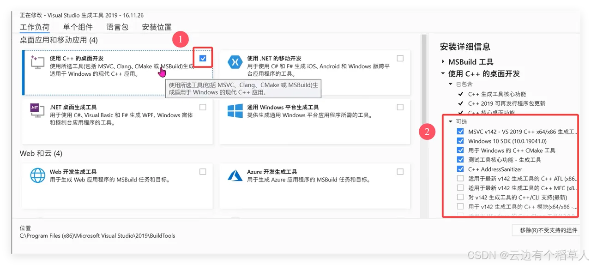

# Install

## Rocky

```bash
# 1.更新系统软件包
sudo dnf update -y

# 2.安装基础编译工具
sudo dnf groupinstall "Development Tools" -y
sudo dnf install gcc gcc-c++ make -y

# 3.安装其他依赖项
# 如果需要使用 cargo 的某些功能或编译 C 依赖
sudo dnf install openssl-devel pkgconfig -y

# 如果需要进行 WebAssembly 开发
sudo dnf install wasm-pack -y --enablerepo=epel

# 如果需要进行嵌入式开发
sudo dnf install libusb-devel -y

# 4.下载并运行官方安装脚本
# 使用 rustup 镜像 清华源
export RUSTUP_DIST_SERVER=https://mirrors.tuna.tsinghua.edu.cn/rustup
export RUSTUP_UPDATE_ROOT=https://mirrors.tuna.tsinghua.edu.cn/rustup/rustup
curl --proto '=https' --tlsv1.2 -sSf https://sh.rustup.rs | sh

# 5.配置环境变量
source $HOME/.cargo/env

# 6.验证安装
rustc --version
cargo --version
rustup --version
```

## Windows

https://visualstudio.microsoft.com/zh-hans/visual-cpp-build-tools/

在这个页面下载vs_BuildTools.exe 工具


然后运行vs_BuildTools.exe



安装完之后进行重启

先添加两个环境变量（用来控制 rust 的安装位置）

CARGO_HOME=D:\software\rust\.cargo
RUSTUP_HOME=D:\software\rust\.rustup

然后在官网找到并下载 rustup-init.exe 程序，进行安装

然后在用户的 PATH 环境变量中添加 D:\software\rust\.cargo\bin

```bash
rustc --version
rustup --version
cargo --version
```

# Config

## Rocky

<details>
<summary>配置 Rust 镜像源</summary>

```bash
# 配置 crates.io 镜像（任选一个就行）
cat >> ~/.cargo/config.toml << 'EOF'
[source.crates-io]
replace-with = 'tuna'

[source.tuna]
registry = "https://mirrors.tuna.tsinghua.edu.cn/git/crates.io-index.git"

[net]
git-fetch-with-cli = true
EOF

cat >> ~/.cargo/config.toml << 'EOF'
[source.crates-io]
registry = "https://github.com/rust-lang/crates.io-index"
replace-with = 'ustc'

[source.ustc]
registry = "git://mirrors.ustc.edu.cn/crates.io-index"

[net]
git-fetch-with-cli = true
EOF
```

</details>

<details>
<summary>配置 Rust 编译器选项</summary>

```bash
# 创建 rustc 配置文件
mkdir -p ~/.rustc
cat > ~/.rustc/config << 'EOF'
# 启用所有警告
-A warnings

# 设置优化级别
-C opt-level=3

# 生成调试信息
-C debuginfo=2
EOF
```

</details>

<details>
<summary>配置 Cargo 环境</summary>

```bash
# 编辑 Cargo 配置文件
cat > ~/.cargo/config.toml << 'EOF'
[build]
# 设置并行编译任务数
jobs = 4

# 设置目标目录
target-dir = "target"

[profile.dev]
# 开发模式优化级别
opt-level = 1
debug = true

[profile.release]
# 发布模式优化级别
opt-level = 3
debug = false
lto = true
codegen-units = 1

[registry]
# 默认注册表
default = "crates-io"

[http]
# 设置超时时间（秒）
timeout = 30
EOF
```

</details>