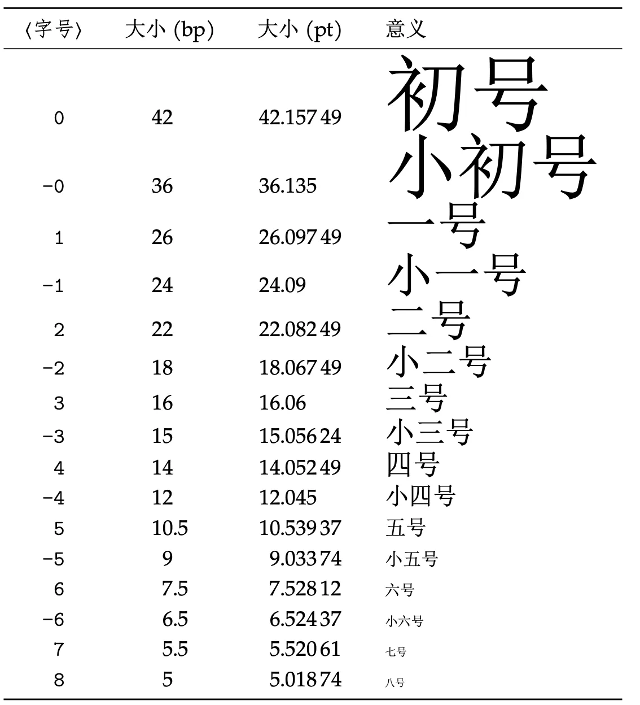

> 【latex 中文教程-15 集从入门到精通包含各种 latex 操作】
> [https://www.bilibili.com/video/BV15x411j7k6](https://www.bilibili.com/video/BV15x411j7k6)

# LaTeX 编译命令

源文件为 sourceTex.tex

```latex
% 第1种编译方式
latex sourceTex.tex % 编译命令
dvipdfmx test.dvi % 将dvi文件编译为PDF文件

% 第2种编译方式
xelatex sourceTex.tex

% 删除编译过程中产生的辅助文件
del *.aux *.dvi *.log
```

可以用批处理命令来编译文件

```bash
xelatex texFileName
biber -l zh__pinyin texFileName
xelatex texFileName
xelatex texFileName
del *.aux *.bbl *.bcf *.blg *.log *.xml
```


# 基本结构

```latex
% 导言区
% 导言区主要用于进行全局设置
\documentclass{article}   % book, report, letter
% 英文文档可以这样用
% \documentclass{article}   % book, report, letter
% 中文文档有以下两种
% 第1种方法
% \documentclass{article}   % book, report, letter
% \usepackage{ctex}
% 第2种方法
% \documentclass{ctexart}
% ctexart、ctexrep、ctexbook和ctexbeamer，分别对应 LaTeX 的标准文档类article、report、book和beamer。
\usepackage{ctex}  % 中文宏包
% 可以在命令行中使用texdoc ctex命令查看ctex宏包使用文档

\newcommand\degree{^\circ} % 自定义命令

\title{\heiti 文章标题} % 可以通过\heiti设置标题为黑体
\author{\kaishu Jack Ma} % \kaishu设置作者字体为楷书
\date{\today}


% 正文区（文稿区）
% 一个latex文件有且仅有一个document环境
\begin{document}
  \maketitle % 用这个命令在正文中输出标题
  hello world, this is a test latex file.
  % 可以用一个空行来实现换行效果

  % 行内公式用$ math formula $ 行间公式用 $$ some text $$
  Let $f(x)$ be defined by the formula $f(x) = 3x^2 + x - 1$.

  $$f(x) = 3x^2 + x - 1$$
  测试中文内容

  $ C = 90 \degree $

  \begin{equation}  % equation环境用于产生带编号的行间公式
    AB^2 = BC^2 + AC^2
  \end{equation}


\end{document}
```

# 字体属性

在 LaTeX 中，一个字体有 5 种属性：

1.字体编码

- 正文字体编码：OT1、T1、EU1 等
- 数学字体编码：OML、OMS、OMX 等

  2.字体族

- 罗马字体：笔画起始处有装饰
- 无衬线字体：笔画起始处无装饰
- 打字机字体：每个字符宽度相同，又称等宽字体

  3.字体系列：粗细，宽度

  4.字体形状：直立，斜体，伪斜体，小型大写

  5.字体大小

```latex
% 导言区
\documentclass[12pt]{article}
\usepackage{ctex}

% 推荐使用这种格式，内容与格式分离
\newcommand{\myfont}{\zihao{-0}\textbf{\textsf{}}}

% 正文区（文稿区）
\begin{document}
  %%%%%%%%%%%%%%%%%%%%%%%%%%%%%%%%%
  % 字体族设置（罗马字体、无衬线字体、打字机字体）%%%%%
  \textrm{Roman Family}  \textsf{Sans Serif Family}   \texttt{Typewriter Family}

  % 不加花括号的，对后面的字体都有效
  % 当遇到另一个字体声明时，才会更改效果
  \rmfamily Roman Family 测试
  % 加了花括号的，只对花括号内的文字起作用
  {\sffamily Sans Serif Family 测试}
  {\ttfamily Typewriter Family}测试

  %%%%%%%%%%%%%%%%%%%%%%%%%%%%%%%%%
  % 字体系列设置（粗细、宽度）%%%%%%%%%%%%%%%%%
  \textmd{Medium Series} \textbf{Boldface Series}

  {\mdseries Medium Series}  {\bfseries Boldface Series}

  %%%%%%%%%%%%%%%%%%%%%%%%%%%%%%%%%
  % 字体形状设置（直立、斜体、伪斜体、小型大写）%%%%%%
  \textup{Upright Shape} \textit{Italic Shape}
  \textsl{Slanted Shape} \textsc{Small Caps Shape}

  {\upshape Upright Shape} {\itshape Italic Shape} {\slshape Slanted Shape} {\scshape Small Caps Shape}

  % 中文字体
  {\songti 宋体} \quad {\heiti 黑体} \quad {\fangsong 仿宋} \quad {\kaishu 楷书}

  % 粗体就是黑体，斜体就是楷书
  中文字体的\textbf{粗体}与\textit{斜体}

  % 字体大小
  % 这些大小是normalsize的相对大小，而normalsize的大小如下设置
  % \documentclass[12pt]{article}
  % 一般只可以设置为 10pt 11pt 12pt 三个等级
  {\tiny            hello，世界}\\
  {\scriptsize      hello，世界}\\
  {\footnotesize    hello，世界}\\
  {\small            hello，世界}\\
  {\normalsize    hello，世界}\\
  {\large          hello，世界}\\
  {\Large          hello，世界}\\
  {\LARGE        hello，世界}\\
  {\huge          hello，世界}\\
  {\Huge          hello，世界}\\

  % 中文字号设置命令
  % 不建议这样使用大量的组合命令，建议使用\newcommand自定义组合命令
  \zihao{5} 你好！% 5号字体

  \myfont

  \myfont 这是我自定义的格式 Test

\end{document}
```



# 篇章结构

**在撰写文档时要养成格式与内容分离的习惯**

```latex
% 导言区
\documentclass{ctexart}

% \usepackage{ctex}

% 设置标题的格式
\ctexset{
  section = {
    format+= \zihao{-4} \heiti \raggedright,
    name = {,、},
    number = \chinese{section},
    beforeskip = 1.0ex plus 0.2ex minus .2ex,
    afterskip = 1.0ex plus 0.2ex minus .2ex,
    aftername = \hspace{0pt}
  },
  subsection = {
    format+ = \zihao{5} \heiti \raggedright,
    % name = {\thesubsection、},
    name = {,、},
    number = \arabic{subsection},
    beforeskip = 1.0ex plus 0.2ex minus .2ex,
    afterskip = 1.0ex plus 0.2ex minus .2ex,
    aftername = \hspace{0pt}
  },
}

% 正文区（文稿区）
\begin{document}

  \section{引言}
  一位真正的作家永远只为内心写作，只有内心才会真实地告诉他，他的自私、他的高尚是多么突出。
  内心让他真实地了解自己，一旦了解了自己也就了解了世界。
  很多年前我就明白了这个原则，可是要捍卫这个原则必须付出艰辛的劳动和长时期的痛苦，
  因为内心并非时时刻刻都是敞开的，它更多的时候倒是封闭起来，于是只有写作，不停地写作才能使内心敞开，
  才能使自己置身于发现之中，就像日出的光芒照亮了黑暗，灵感这时候才会突然来到。

  % 空行是换一个段落（推荐这种写法）
  一位真正的作家永远只为内心写作，只有内心才会真实地告诉他，他的自私、他的高尚是多么突出。
  内心让他真实地了解自己，一旦了解了自己也就了解了世界。很多年前我就明白了这个原则，
  \\% 反斜杠命令只是换行，不能实现换一个段落
  可是要捍卫这个原则必须付出艰辛的劳动和长时期的痛苦，因为内心并非时时刻刻都是敞开的，它更多的时候倒是封闭起来，
  % 可以使用\par命令产生新的段落
  \par
  于是只有写作，不停地写作才能使内心敞开，才能使自己置身于发现之中，就像日出的光芒照亮了黑暗，灵感这时候才会突然来到。

  \section{实验方法}

  \section{实验结果}
  \subsection{数据}

  \subsection{图表}

  \subsection{结果分析}
  \subsubsection{实验条件}

  \section{结论}

  \section{致谢}

\end{document}
```

```latex
% 导言区
\documentclass{ctexbook}

% \usepackage{ctex}

% 设置标题的格式
\ctexset{
  section = {
    format+= \zihao{-4} \heiti \raggedright,
    name = {,、},
    number = \chinese{section},
    beforeskip = 1.0ex plus 0.2ex minus .2ex,
    afterskip = 1.0ex plus 0.2ex minus .2ex,
    aftername = \hspace{0pt}
  },
  subsection = {
    format+ = \zihao{5} \heiti \raggedright,
    % name = {\thesubsection、},
    name = {,、},
    number = \arabic{subsection},
    beforeskip = 1.0ex plus 0.2ex minus .2ex,
    afterskip = 1.0ex plus 0.2ex minus .2ex,
    aftername = \hspace{0pt}
  },
}

% 正文区（文稿区）
\begin{document}

  % 这个命令可以生成目录
  \tableofcontents

  % 要使用\chapter 必须设置为\documentclass{ctexbook}
  \chapter{绪论}

  \section{引言}
  一位真正的作家永远只为内心写作，只有内心才会真实地告诉他，他的自私、他的高尚是多么突出。
  内心让他真实地了解自己，一旦了解了自己也就了解了世界。
  很多年前我就明白了这个原则，可是要捍卫这个原则必须付出艰辛的劳动和长时期的痛苦，
  因为内心并非时时刻刻都是敞开的，它更多的时候倒是封闭起来，于是只有写作，不停地写作才能使内心敞开，
  才能使自己置身于发现之中，就像日出的光芒照亮了黑暗，灵感这时候才会突然来到。

  % 空行是换一个段落（推荐这种写法）
  一位真正的作家永远只为内心写作，只有内心才会真实地告诉他，他的自私、他的高尚是多么突出。
  内心让他真实地了解自己，一旦了解了自己也就了解了世界。很多年前我就明白了这个原则，
  \\% 反斜杠命令只是换行，不能实现换一个段落
  可是要捍卫这个原则必须付出艰辛的劳动和长时期的痛苦，因为内心并非时时刻刻都是敞开的，它更多的时候倒是封闭起来，
  % 可以使用\par命令产生新的段落
  \par
  于是只有写作，不停地写作才能使内心敞开，才能使自己置身于发现之中，就像日出的光芒照亮了黑暗，灵感这时候才会突然来到。

  \section{实验方法}

  \section{实验结果}
  \subsection{数据}

  \subsection{图表}

  \subsection{结果分析}
  \subsubsection{实验条件}

  \chapter{实验与结果分析}
  \section{结论}

  \section{致谢}

\end{document}
```

# 特殊字符

```latex
% 导言区
\documentclass{article}

\usepackage{ctex}
\usepackage{xltxtra} % 提供了针对XeTeX的改进并且加入了XeTeX的logo
\usepackage{texnames} % 一些logo
\usepackage{mflogo}

% 正文区（文稿区）
\begin{document}
  \section{空白符号}
  % 空行分段，多个空行等同1个空行
  % 自动缩进，绝对不能使用空格代替
  % 英文中多个空哥处理为1个空格，中文中空格将被忽略
  % 汉字与其他字符的间距会自动由XeLaTeX处理
  % 禁止使用中文全角空格

   Deploying deep learning    models on embedded systems has been challenging due to limited computing resources. 
   The majority of existing work focuses on accelerating image classification, 
   while other fundamental vision problems, such as object detection, have not been adequately addressed. 
   Compared with image classification, detection problems are more sensitive to the spatial variance of objects

  地主少爷富贵嗜赌成性，终于赌光了家业一贫如洗，穷困之中富贵的富贵因为母亲生病前去求医，
  没想到半路上被国民党部队抓了壮丁，后被解放军所俘虏，回到家乡他才知道母亲已经去世，
  妻子家珍含辛茹苦带大了一双儿女，但女儿不幸变成了聋哑人，儿子机灵活泼……然而，
  真正的悲剧从此才开始渐次上演，每读一页，都让我们止不住泪湿双眼，
  因为生命里难得的温情将被一次次死亡撕扯得粉碎，只剩得老了的富贵伴随着一头老牛在阳光下回忆。

  % 1em(当前字体中M的宽度)
  a \quad b

  % 2em
  a \qquad b

  % 约为1/6个em
  a \, b a \thinspace b

  % 0.5个em
  a \enspace b

  % 空格
  a \  b

  % 硬空格
  a~b

  % 1pc = 12pt = 4.218mm
  a \kern 1pc b

  a \kern -1em b

  a \hskip 1em b

  a \hspace{35pt} b

  % 占位宽度
  a \hphantom{xyz} b

  % 弹性长度
  a \hfill b

  \section{\LaTeX 控制符}
  \# \$ \% \{ \} \~{} \_{} \^{} \textbackslash \&
  \section{排版符号}
  \S \P \dag \ddag \copyright \pounds
  \section{\TeX 标志符号}
  % 基本符号
  \TeX{} \LaTeX{} \LaTeXe{}
  % xltxtra宏包提供
  \XeLaTeX

  % texnames宏包提供
  \AmSTeX{} \AmS-\LaTeX{}
  \BibTeX{} \LuaTeX{}

  % mflogo宏包提供
  \METAFONT{} \MF{} \MP{}

  \section{引号}
  `   '      ``    ''

  \section{连字符}
  -    --     ---

  \section{非英文字符}
  \oe \OE \ae \AE \aa \AA \o \O \l \L \ss \SS !` ?`

  \section{重音符号（以o为例）}
  \`o \'o \^o \''o \~o \=o \.o \u{o} \v{o} \H{o} \r{o} \t{o} \b{o} \c{o} \d{o}

\end{document}
```

# 插图

texdoc graphicx

```latex
% 导言区
\documentclass{ctexart} % ctexbook, ctexrep

% \usepackage{ctex}
% 导言区：\usepackage{graphicx}
% 语法：\includegraphics[< 选项 >]{< 文件名 >}
% 格式：EPS, PDF, PNG, JPEG, BMP
\usepackage{graphicx}
\graphicspath{{figures/}, {pics/}} % 图片在当前目录下的figures目录

% 正文区（文稿区）
\begin{document}
    \LaTeX{}中的插图：

    \includegraphics{lion.eps}
    \includegraphics{mountain.jpg}
    \includegraphics{oscilloscope.pdf}

    \includegraphics[scale=0.3]{lion.eps}
    \includegraphics[scale=0.03]{mountain.jpg}
    \includegraphics[scale=0.3]{oscilloscope.pdf}

    \includegraphics[height=2cm]{lion.eps}
    \includegraphics[height=2cm]{mountain.jpg}
    \includegraphics[height=2cm]{oscilloscope.pdf}

    \includegraphics[width=2cm]{lion.eps}
    \includegraphics[width=2cm]{mountain.jpg}
    \includegraphics[width=2cm]{oscilloscope.pdf}

    \includegraphics[height=0.1\textheight]{lion.eps}
    \includegraphics[height=0.1\textheight]{mountain.jpg}
    \includegraphics[height=0.1\textheight]{oscilloscope.pdf}

    \includegraphics[width=0.2\textwidth]{lion.eps}
    \includegraphics[width=0.2\textwidth]{mountain.jpg}
    \includegraphics[width=0.2\textwidth]{oscilloscope.pdf}

    \includegraphics[angle=-45, width=0.2\textwidth]{lion.eps}
    \includegraphics[width=0.2\textwidth]{mountain.jpg}
    \includegraphics[angle=45, width=0.2\textwidth]{oscilloscope.pdf}

\end{document}
```

# 表格

texdoc booktab

texdoc longtab

texdoc tabu

```latex
% 导言区
\documentclass{ctexart} % ctexbook, ctexrep

% \usepackage{ctex}

% \begin{tabular}[<垂直对齐方式>]{<列格式说明>}
%    <表项> & <表项> & ... & <表项> \\
%    ......
% \end{tabular}
% 用\\表示换行
% 用&表示不同的列
% l 本列左对齐
% c 本列居中对齐
% r 本列右对齐
% p{<宽>} 本列宽度固定，能够自动换行

% 正文区（文稿区）
\begin{document}
  % l是左对齐，c是居中对其，r是右对齐， | 可以产生竖线， ||可以产生表格双竖线
  % p可以指定列宽
  \begin{tabular}{l |c| c| c| |p{1.5cm}|}
    % hline产生横线
    \hline
    姓名 & 语文 & 数学 & 外语 & 备注 \\
    \hline \hline % 两个hline产生双横线
    张三 & 10 & 20 & 30 & 优秀 \\
    李四 & 40 & 50 & 60 & 补考 \\
    \hline

  \end{tabular}
\end{document}
```

# 浮动体

```latex
% 导言区
\documentclass{ctexart} % ctexbook, ctexrep

% \usepackage{ctex}
\usepackage{graphicx}
\graphicspath{{figures/}}

% 正文区（文稿区）
\begin{document}

  % \ref可以设置标签引用，实现交叉引用
  \LaTeX{}中的插图，小狮子见图\ref{fig-lion}
  \begin{figure}[htbp] % 通过指定参数指定排版位置
    \centering % 让环境中的内容居中排版
    \includegraphics[scale=0.3]{lion.jpg}
    % caption设置插图的标题
    % lable设置标签
    \caption{\TeX 系统的吉祥物}\label{fig-lion}
  \end{figure}

  在\LaTeX{}中的表格
  \begin{table}
    \centering
    % 可以自动编号
    \caption{考试成绩单}
    \begin{tabular}{l |c| c| c| |p{1.5cm}|}
      % hline产生横线
      \hline
      姓名 & 语文 & 数学 & 外语 & 备注 \\
      \hline \hline % 两个hline产生双横线
      张三 & 10 & 20 & 30 & 优秀 \\
      李四 & 40 & 50 & 60 & 补考 \\
      \hline
    \end{tabular}
  \end{table}

\end{document}
```

# 数学公式

```latex
\usepackage{amsmath} % 需要使用amsmath宏包来对数学公式的支持

% 需要对公式自动编号时，用equation环境
% 用label和ref标签来自动交叉引用
\section{测试}
交换律见公式\ref{eq:commutative}
\begin{equation}
    a + b = b + a \label{eq:commutative}
\end{equation}

% equation*环境不会自动编号
% 而是会引用小节的编号
\section{内容}
交换律见公式\ref{eq:commu}
\begin{equation*}
    a + b = b + a \label{eq:commu}
\end{equation*}
```

# 自定义命令和环境

```latex
% 导言区
\documentclass{ctexart} % ctexbook, ctexrep

% \newcommand-自定义命令
% 命令只能由字母组成，不能以\end开头
% \newcommand<命令>[<参数个数>][<首参数默认值>]{<具体定义>}

% \newcommand 可以是简单字符串替换，例如：
% 使用 \PRC 相当于 People's Republic of \emph{China} 这一串内容
\newcommand\PRC{People's Republic of \emph{China}}

% \newcommand 也可以使用参数
% 参数个数可以从1到9，使用时用 #1, #2, ..., #9 表示
\newcommand\loves[2]{#1 喜欢 #2}
\newcommand\hatedby[2]{#2 不受 #1 喜欢}

% \newcommand 的参数也可以有默认值
% 指定参数个数的同时指定了首个参数的默认值，那么这个命令的第一个参数就称为可选则参数（要使用中括号指定）
\newcommand\love[3][喜欢]{#2#1#3}

% \renewcommand-重定义命令
% 与\newcommand 命令作用和用法相同，但只能用于已有命令
% \renewcommand<命令>[<参数个数>][<首参数默认值>]{<具体定义>}
\renewcommand\abstractname{内容介绍}

% 定义和重定义环境
% \newenvironment{<环境名称>}[<参数个数>][<首参数默认值>]
%                 {<环境前定义>}
%                 {<环境后定义>}
% \renewenvironment{<环境名称>}[<参数个数>][<首参数默认值>]
%                 {<环境前定义>}
%                 {<环境后定义>}

% 为book类中定义摘要（abstract）环境
\newenvironment{myabstract}[1][摘要]{
  \small
  \begin{center} \bfseries #1 \end{center}
  \begin{quotation}
}{
  \end{quotation}
}
% 环境参数只有<环境前定义>中可以使用参数，
% <环境后定义>中不能再使用环境参数
% 如果需要，可以先把前面得到的参数保存再一个命令中，在后面使用
\newenvironment{Quotation}[1]{
  \newcommand\quotesource{#1}
  \begin{quotation}
}{
  \par \hfill --- 《\textit{\quotesource} 》
  \end{quotation}
}

% 正文区（文稿区）
\begin{document}

  \PRC

  \loves{猫}{鱼}

  \hatedby{猫}{萝卜}

  \love{猫}{鱼}

  \love[最爱]{猫}{鱼}

  \begin{abstract}
    这是一段摘要...
  \end{abstract}

  \begin{myabstract}[我的摘要]
    这是一段自定义格式的摘要...
  \end{myabstract}

  \begin{Quotation}{易$\cdot$乾}
    初九，潜龙勿用
  \end{Quotation}

\end{document}
```

# 参考文献

## BibTex

```latex
% 导言区
\documentclass{ctexart} % ctexbook, ctexrep

% \usepackage{ctex}

% 正文区（文稿区）
\begin{document}
  % 一次管理，一次使用
  % 参考文献格式：
  % \begin{thebibliography}{编号样本}
    %   \bibitem[记号]{引用标志}文献条目1
    %   \bibitem[记号]{引用标志}文献条目2
    %   ...
    % \end{thebibliography}
  % 其中文献条目包括：作者，题目，出版社，年代，版本，页码等。
  % 引用时候要可以采用：\cite{引用标志1，引用标志2，...}

  引用一篇文章\cite{article1}
  引用一本书\cite{book1}等等。

  \begin{thebibliography}{99}
    % \emph{}命令用来强调参考文献中的某些内容
    % \texttt{}命令也有类似的效果
    \bibitem{article1}陈立辉,苏伟，蔡川，陈晓云.\emph{基于LaTeX的Web数学公式提取方法研究}[J]. 计算机科学. 2014(06)
    \bibitem{book1} William H. Press, Saul A. Teukolsky, William T. Vetterling, Brain P. Flannery, \emph{Numerical Recipes 3rd Edition: The Art of Scientific Computing}
    Cambridge University Press, New York, 2007.
    \bibitem{latexGuide} Kopka Helmut, W. Daly Patrick, \emph{Guide to \LaTeX}, $4^{th}$ Edition. Available at \texttt{http://www.amazon.com}.
    \bibitem{latexMath} Graetzer George, \emph{Math Into \LaTeX}, Birkhauser Boston; 3 edition (June 22, 2000).
  \end{thebibliography}

\end{document}
```

上面的做法不太方便，应该将参考文献抽出来，形成一个单独的文件。

## bib 文件

test.bib

```latex
% test.bib
@BOOK{mittelbach2004,
  title = {The {{\LaTeX}} Companion},
  publisher = {Addison-Wesley},
  year = {2004},
  author = {Frank Mittelbach and MIchel Goossens},
  series = {Tools and Techniques for Computer Typesetting},
  address = {Boston},
  edition = {Second}
}

@BOOK{mittelbach2001,
  title = {The {{\LaTeX}} Companion},
  publisher = {Addison-Wesley},
  year = {2004},
  author = {Frank Mittelbach and MIchel Goossens},
  series = {Tools and Techniques for Computer Typesetting},
  address = {Boston},
  edition = {Second}
}
```

latex.tex

```latex
% latex.tex
% 导言区
\documentclass{ctexart} % ctexbook, ctexrep

\usepackage{natbib} % 可以用这个宏包来使用更多参考文献的排版样式
\bibliographystyle{plain} % 指定参考文献的排版样式

% 正文区（文稿区）
\begin{document}

  这是一个参考文献的引用：\cite{mittelbach2004}

  % 用来将没有引用的参考文献也一同列出来
  % 也可以在{}中指定特定参考文献，*表示列出所有文件
  \nocite{*}
  % 指定参考文献数据库，可以不指定扩展名
  % 当有多个参考文献数据库，可以用逗号分隔
  \bibliography{test, cnki}

\end{document}
```

## BibLaTeX

```latex
% 导言区
\documentclass{ctexart} % ctexbook, ctexrep

% \usepackage{ctex}
% biblatex/biber
% 新的TEX参考文献排版引擎
% 样式文件（参考文献样式文件--bbx文件，引用样式文件--cbx文件）使用LaTeX编写
% 支持根据本地化排版，如：
%    biber -l zh__pinyin texfile，用于指定按拼音排序
%    biber -l zh__stroke texfile，用于按笔画排序
% 需要在文献工具中设置命令为：Biber
\usepackage[style=numeric, backend=biber]{biblatex}
\addbibresource{test.bib}

% 正文区（文稿区）
\begin{document}

  无格式化引用\cite{mittelbach2001}

  带方括号的引用\parencite{mittelbach2001}

  上标引用\supercite{mittelbach2001}

  \printbibliography[title={参考文献}]

\end{document}
```

# 插入代码

## Python代码

在这个 GitHub 库（https://github.com/olivierverdier/python-latex-highlighting） 里下载pythonhighlight.sty文件，放到和tex文件同一个目录下面。

在导言区加入：

```latex
\usepackage{graphicx}
\usepackage{pythonhighlight}
```

在正文部分加入：

```latex
\begin{python}
import numpy as np
import pandas as pd
print('why use Matlab?')
\end{python}
```

# 分文件编写

[https://www.itdaan.com/blog/2013/10/27/d234a613a7a848951e360180250f3b61.html](https://www.itdaan.com/blog/2013/10/27/d234a613a7a848951e360180250f3b61.html)

一般来说 latex 提供了两种包含子文件的方法：

`\input`和`\include`

一般编写书籍的时候使用`\include`，并且一章一个文件，因为它会自动给每个被`include`的部分创建一个新页。而写论文的时候多用`\input`。

需要提一下，导言区只需要宿主文件有就可以了，被包含的文件会沿用它。

## 用法

```latex
\input{chapter1}
\include{chapter2}
```

注意不加.tex 的后缀。

## 区别

- \input  
  它完全相当于 C/C++语言中的#include，可以理解为只起一个文本替换的作用。  
  因而，它可以嵌套使用。可以在任何位置使用（特别强调一下：可以在导言区使用）。  
  但是，任何一个子文件修改后，都需要对全文进行重新编译。所以对于编译有好几百页的书籍来说用它来管理章节是不太方便的（但是各个章节内部可以使用它），但对于论文，这点额外时间完全可以接受。  
  由于它只是一个文本替换，因而如果想只编译某些章节，那么所有的自动编号都会根据现在的内容重新编排。即如果第一章有 3 个公式，那么第二章的第一个公式应该是“公式 4”，如果我把第一章的\input 注释掉，那么第二章第一个公式会是“公式 1”。同样的情况还出现在图标、章节等所有自动编号上。
- \include  
  为了实现不改变最终效果（编号等资源的显示）的部分章节调试，可以使用\include 和与之配套的\includeonly。  
  它类似于编程中编译好的库文件。  
  它只能用在正文区，用来引入正文。  
  每个\include 的部分开始时会新起一页。  
  在某个部分修改的时候，针对宿主文件的重新编译不会影响其他文件。因而很节约编译时间。  
  如果只想在生成的文件中显示部分章节，不需要对正文区的\include 做任何操作，只需要在导言区写诸如\includeonly{chapter1,chapter3,chapter14}的一句就可以了。它表示只生成第 1、3、14 章。并且它不会因为把显示中间的章节，就把它们的自动编号空过去（但是如果在正文区注释掉了，那就另当别论了）。

# 条件编译

latex 可以使用：

```latex
\ifx...
...
\else
...
\fi
```

的结构执行条件指令。这在一些会议期刊所提供的 latex 模板中很常见，多是用来根据编译器版本选择合适的包和参数。

我们可以利用它来实现自动补完结构信息的功能。

如果你有 C/C++语言的相关知识，下面的概念会非常好理解，如果没有也没有关系，只需要按照后面“例 2”中黑体的部分操作就可以了。

我们可以在宿主文件中定义（\def）一个编译期常量，然后让各个子文件去检测这个常量是否存在，如果不存在就写入结构信息。

例如：

\def 的用法是这样的：\def\my_variable{hello}

它定义了一个名为“my_variable”的宏，它的内容是“hello”。

再在各个子文件中使用\ifx\my_variable\undefine 来检测这个宏是否没有定义（latex 没有提供"\defined"来检测是否已定义），并添加相应的内容。

## 例 1

```latex
%----------------my_paper.tex--------------
\documentclass{article}
%导言区\usepackage{...}
\begin{document}
\input{1-abstract}
\input{2-introduction}
\input{3-model}
\input{4-data}
\input{5-solve}
\input{6-conclusion}
\input{7-acknowledgment}
\bibliography{ref}
\bibliographystyle{abbrv}
\end{document}
%----------------1-abstract.tex---------------

\begin{abstract}
This paper .....
\end{abstract}
%-----------------2-introduction.tex------------

\section{Introduction}
..........
%----------------3-model.tex----------------

\section{Model}
............
\begin{equation}
........
\end{equation}
\subsection{Provement}
..............
```

## 例 2

由于导言区在每个独立编译的部分都中要使用，所以在这里可以将它也独立成一个文件（命名为 0-preamble.tex）。

```latex
%----------------my_paper.tex--------------
\input{0-preamble}
\def\all_in_one{all_in_one} % 条件编译
\begin{document}
\input{1-abstract}
\input{2-introduction}
\input{3-model}
\input{4-data}
\input{5-solve}
\input{6-conclusion}
\input{7-acknowledgment}
\bibliography{ref}
\bibliographystyle{abbrv}
\end{document}

%----------------0-preamble.tex---------------

\documentclass{article}
%导言区
\usepackage{...}

%----------------3-model.tex----------------
% 下面这一块属于条件编译
\ifx\all_in_one\undefined
\input{0-preamble}
\begin{document}
\fi

\section{Model}
............
\begin{equation}
........
\end{equation}
\subsection{Provement}
..............

% 下面这一块属于条件编译
\ifx\all_in_one\undefined
\end{document}
\fi
```

# 插入封面

参考链接：https://zhuanlan.zhihu.com/p/164590399

在导言区插入如下代码。

```latex
\usepackage{pdfpages}
```

在正文部分插入如下代码

```latex
\begin{titlepage}
    \includepdf[pages={1}]{cover.pdf}
\end{titlepage}
```
